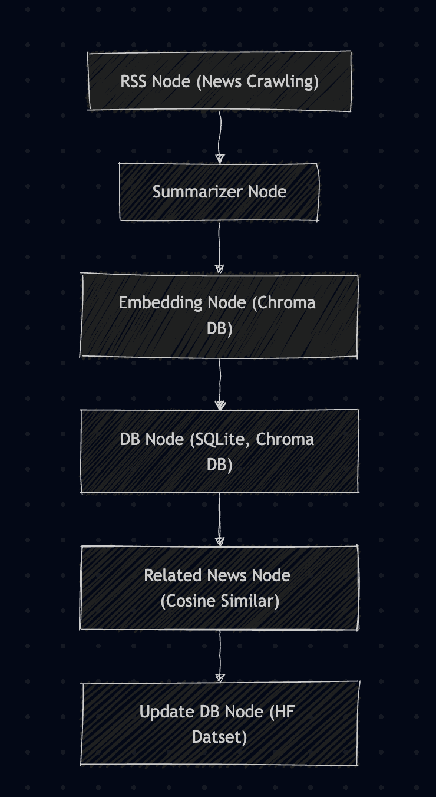

# NewsCurator

LLM 기반 **뉴스 일일동향 AI 에이전트**  
최신 뉴스를 수집하고, 중복 필터링 & 카테고리 분류 & 요약 & 중요도 스코어링을 통해  
**가장 중요한 뉴스를 자동으로 선별해고 요약해주는 서비스**  

---

## Demo
[Hugging Face Spaces](https://huggingface.co/spaces/HSJay/NewsCurator)  

---
## Features

- **News Crawling**
  - Google RSS
  - 중복 뉴스 필터링
  - SQLite3, ChromaDB
- **3줄 요약**
  - 사용 모델 : Ollama `qwen3:0.6b`, `PetrosStav/gemma3-tools:4b`
  - **프롬프트 전략**
    - **Role 부여**, **Few-shot**, **Chain of Thought**, **Self-Critique Routine**
  - **Summary Test**
    - **Role 부여**  
      > 토르스텐 슬록 수석 이코노미스트는 현재 뉴욕증시 상위 10개 기업의 고평가 심화를 경고하며, AI 버블이 1990년대 IT 버블보다 심각하다고 분석했습니다. 특히, AI 관련 주식의 시가총액이 1990년대 IT 버블 시기를 넘어선 점을 지적하며, 빅테크 기업들의 주가 상승이 기업 이익 증가에 기인한다고 평가했습니다. 이러한 분석은 뉴욕증시의 강세 지속에 대한 우려를 낳고 있습니다.
    - **Few-shot**
      > 아폴로 글로벌 매니지먼트의 토르스텐 슬록 수석 이코노미스트는 뉴욕증시 시총 상위 10개 기업이 1990년대 IT 버블보다 더 고평가되었다고 분석했습니다. AI 기술 열풍으로 인해 엔비디아를 비롯한 빅테크 기업들이 주가를 급등했지만, 월가에서는 2000년 IT 버블 붕괴와 유사한 현상이 발생할 가능성은 낮다고 전망합니다. 현재 AI 관련 주식의 고평가는 기업 이익 증가에 기인하며, 향후 미 증시는 빅테크 부문을 중심으로 강세장을 지속할 것으로 예상됩니다.
    - **Chain of Thought**
      > Step 1: 핵심 문장
      >  - 현재 뉴욕증시 시총 상위 10개 기업이 1990년대 IT 버블보다 더 고평가되었다.  
      >  - AI 관련 주식의 버블이 1990년대 말 IT 버블보다 심각하다는 월가 전문가의 경고가 있다.  
      >  - AI 기업 주가의 상승은 평가가치 상승보다는 기업이익 증가에 기인한다.  
      > Step 2: 최종 요약 (3문장 이내)
      >  1. 뉴욕증시 시총 상위 10개 기업이 1990년대 IT 버블보다 현재 더 고평가되어, 월가 전문가들이 심각한 버블 경고를 내리고 있다.  
      >  2. AI 열풍에 힘입어 엔비디아를 필두로 한 빅테크 기업들의 주가가 상승했지만, 이는 기업이익 증가에 기인한다.  
      >  3. 2000년 IT 거품 붕괴와 같은 현상으로 이어질 가능성은 작다는 분석이 주를 이루고 있다.  
    - **Self-Critique Routine (요약 → 보완 → 최종 요약)**
        > 1. 초안 요약 
        >아폴로 글로벌 매니지먼트의 토르스텐 슬록 수석 이코노미스트는 현재 뉴욕증시 시총 상위 10개 기업이 1990년대 IT 버블 당시 기업보다 더 고평가되어 있다는 점을 지적했습니다. 특히 AI 관련 주식의 급등으로 인해 주가수익비율(PER)이 30배에 육박하는 현상을 우려하고 있습니다. 월가 전문가들은 AI 열풍에 힘입어 주가가 상승했지만, 2000년 IT 버블 붕괴와 같은 심각한 거품 붕괴 가능성은 낮다고 분석합니다.

        > 2. 보완할 정보
        > AI 버블의 구체적인 특징: AI 버블이 1990년대 IT 버블과 구체적으로 어떤 차이점을 보이는지 (예: 기술의 성숙도, 시장의 성숙도, 투자 심리 등)
        > 주요 AI 기업의 시가총액: 엔비디아 외에 다른 주요 AI 기업들의 시가총액 정보 (예: 메타, 마이크로소프트 등)
        > AI 투자 심리: AI 투자에 대한 투자자들의 심리 상태 (예: 과도한 낙관론, FOMO(Fear Of Missing Out) 현상 등)
        > 거품 붕괴 가능성에 대한 추가 분석: 거품 붕괴 가능성에 대한 전문가들의 의견을 좀 더 구체적으로 정리하고, 붕괴 시나리오에 대한 예측을 추가할 수 있습니다.

        > 3. 최종 요약
        > 토르스텐 슬록 아폴로 글로벌 매니지먼트 수석 이코노미스트는 현재 뉴욕증시 시총 상위 10개 기업이 1990년대 IT 버블 당시 기업보다 더 고평가되어 있다는 점을 강조하며, 특히 인공지능(AI) 관련 주식의 급격한 상승에 대한 우려를 표명했습니다. 엔비디아를 필두로 하는 빅테크 기업들의 시총이 사상 최고치를 경신하는 가운데, 투자자들의 과도한 낙관론과 FOMO(Fear Of Missing Out) 현상으로 인해 주가가 지나치게 높게 평가될 수 있다는 분석입니다. 월가 전문가들은 AI 기술의 잠재력을 고려할 때, 2000년 IT 버블 붕괴와 같은 극단적인 거품 붕괴 가능성은 낮다고 전망하지만, 시장 변동성에 대한 주의가 필요합니다.

---

- **연관 기사 클러스터링**
  - **사용 모델**
    - `BAAI/bge-m3` (Huggingface)
    - Ollama 로컬 임베딩 모델
  - **처리 방식**
    - 기사 임베딩 → `KMeans`, `DBSCAN`, `HDBSCAN`, `cosine_similarity`(threshold > 0.8)

---

- **Demo**
  - Huggingface Space
  - Huggingface Dataset

---
- **LangGraph Workflow**

---
**Tech Stack**
- **Language**: Python 3.12
- **Framework**: FastAPI
- **Database**: SQLite / ChromaDB
- **LLM**: Ollama(로컬) or OpenAI API
- **Deployment**: Hugging Face Spaces / Docker
